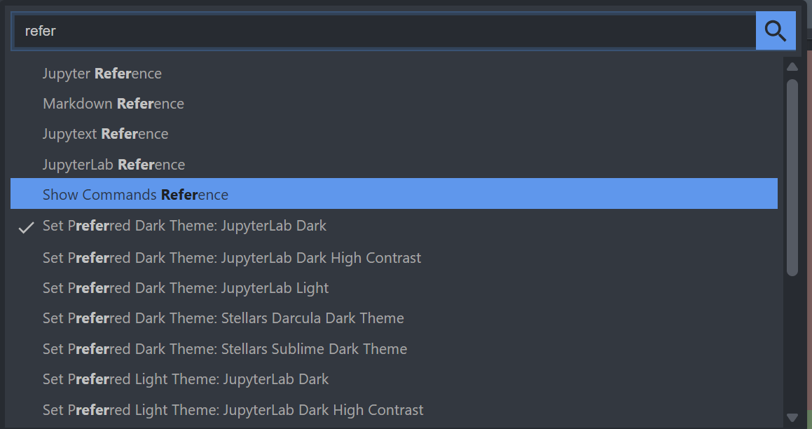
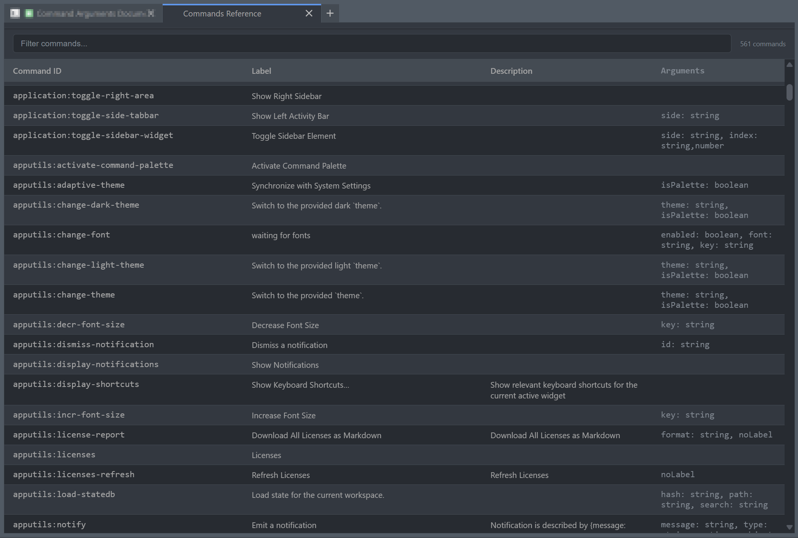

# jupyterlab_show_commands_reference_extension

[](https://github.com/stellarshenson/jupyterlab_show_commands_reference_extension/actions/workflows/build.yml)
[](https://www.npmjs.com/package/jupyterlab_show_commands_reference_extension)
[](https://pypi.org/project/jupyterlab-show-commands-reference-extension/)
[](https://pepy.tech/project/jupyterlab-show-commands-reference-extension)
[](https://jupyterlab.readthedocs.io/en/stable/)
[](https://kolomolo.com)
[](https://www.paypal.com/donate/?hosted_button_id=B4KPBJDLLXTSA)

Display all available JupyterLab commands with their full reference IDs and arguments in a dedicated tab. A reference help page for developers working with JupyterLab commands.





## Features

- **Command reference tab** - Opens a new tab listing all registered JupyterLab commands
- **Full command IDs** - Shows complete command identifiers (e.g., `iframe:open`, `filebrowser:copy`)
- **Argument inspection** - Displays command arguments extracted from the application in realtime
- **Searchable list** - Filter commands by name or description

## Requirements

- JupyterLab >= 4.0.0

## Installation

```bash
make install
```

Or via pip:

```bash
pip install jupyterlab_show_commands_reference_extension
```

## Uninstall

```bash
pip uninstall jupyterlab_show_commands_reference_extension
```
